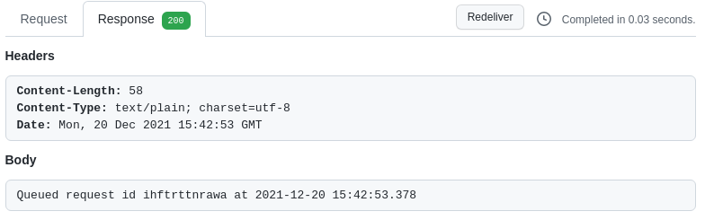
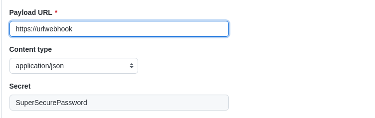

# Overview

This is an example of a custom tekton listener to receive requests from Github webhooks. It is also an example of how to use Kubernetes client-go library for typed and dynamic clients.

#### Some clarifications
- This example is only for GitHub.
- Tekton is an amazing product, but some people find certain drawbacks in the EventListeners part. *custom-tekton-listener* is an example of how to try to solve some of those drawbacks.

#### Why might you need to create a custom listener and not use tekton Triggers and EventListeners? 

These are some reasons. 

## 1. A single access point
All webhooks are configured to point to the same endpoint. Only one endpoint to run any tekton pipeline. This can help for automation, specially for creating git repos and their webhooks.

## 2. Controls source IPs
*custom-tekton-listener* can accept requests from anywhere or only if they come from Github. To do this, you just have to set the environment variable CHECK_GITHUB_IPS to true (true is the default value)

## 3. Customize response to Github
*custom-tekton-listener* creates a unique id for each request from Github and it is associated with the PipelineRun to be created. That id is returned to Github in the answer for troubleshooting. 



For instance, you can use it in commands like
```bash
oc get pipelinerun -l pipelineRunId=ihftrttnrawa
```

## 4. Custom logs
*custom-tekton-listener* uses the logrus library with custom fields, like *pipelineRunId*. This way you can better trace what happens until an instance of the PipelineRun resource is created, or not.

If the logs are sent to a centralized platform, such as ELK, the issue can be found more easily.

Example log
```bash
time="2021-12-21 09:53:00" level=info msg="pipelinerun is not launched because does not meet the when conditions" pipelineRunId=wupwq0o7gozs
```

## 5. Customize pipeline execution
This is the most important reason why you might consider creating a custom listener.

From the [official tekton documentation](https://tekton.dev/docs/triggers/triggertemplates/#triggertemplates) 

> A TriggerTemplate is a resource that specifies a blueprint for the resource, such as a TaskRun or PipelineRun, that you want to instantiate and/or execute when your EventListener detects an event. It exposes parameters that you can use anywhere within your resource’s template.

And here the [example](https://tekton.dev/docs/triggers/triggertemplates/#structure-of-a-triggertemplate)
```bash
 1 apiVersion: triggers.tekton.dev/v1beta1
 2 kind: TriggerTemplate
 3 metadata:
 4   name: pipeline-template
 5 spec:
 6   params:
 7   - name: gitrevision
 8     description: The git revision
 9     default: main
10   - name: gitrepositoryurl
11     description: The git repository url
12   - name: message
13     description: The message to print
14     default: This is the default message
15   - name: contenttype
16     description: The Content-Type of the event
17   resourcetemplates:
18   - apiVersion: tekton.dev/v1beta1
19     kind: PipelineRun
20     metadata:
21       generateName: simple-pipeline-run-
22     spec:
23       pipelineRef:
24         name: simple-pipeline
25       params:
26       - name: message
27         value: $(tt.params.message)
28       - name: contenttype
29         value: $(tt.params.contenttype)
30       resources:
31       - name: git-source
32         resourceSpec:
33           type: git
34           params:
35           - name: revision
36             value: $(tt.params.gitrevision)
37           - name: url
38             value: $(tt.params.gitrepositoryurl)
```
The most important line is 21. As you can see the prefix name is fixed. 

*generateName* field will generate an unique id, so the PipelineRun name will be unique, but not the prefix. That means that at a glance it is not easy to recognize which repo launched the pipeline. Especially when you use the dashboard.

*custom-tekton-listener* also creates a unique name for each PipelineRun resource, but the prefix is obtained from the http request (more explantions later). 

Therefore it is possible to configure the name of the PipelineRun in the repo that launched it. Thus, we can launch the same pipeline from multiple repositories with a custom name for PipelineRun. This helps a lot when troubleshooting.

This is the Golang template from [source code](https://github.com/jaberchez/custom-tekton-listener/blob/main/pkg/tekton/tekton.go)
```bash
 1 var pipelineRunTemplate string = fmt.Sprintf(`apiVersion: %s/%s
 2 kind: %s
 3 metadata:
 4   name: {{ .Prefix }}-{{ .ID }}
 5   namespace: {{ .Namespace }}
 6   annotations:
 7     {{- range $key, $value := .Annotations }}
 8     {{ $key }}: "{{ $value }}"
 9     {{- end }}
10   labels:
11     {{- range $key, $value := .Labels }}
12     {{ $key }}: "{{ $value }}"
13     {{- end }}
14 spec:
15   {{- $length := len .ServiceAccount }} {{ if gt $length 0 }}
16   serviceAccountName: {{ .ServiceAccount }}
17   {{- end }}
18   params:
19     {{- range $key, $value := .Params }}
20     - name: {{ $key }}
21       value: "{{ $value }}"
22	  {{- end }}
23   pipelineRef:
24     name: {{ .PipelineName }}
25   {{- $length := len .Workspaces }} {{ if gt $length 0 }}	
26   workspaces:
27   {{- template "workspaces" . }}
28   {{- end }}
29   {{- $length := len .Resources }} {{ if gt $length 0 }}	
30   resources:
31   {{- range .Resources }}
32     - name: {{ .Name }}
33       resourceRef:
34         name: {{ .ResourceRef }}
35   {{- end }}
36   {{- end }}
37` , tektonApiGroup, tektonApiVersion, pipelineRunKind)
```

As you can see in line 4 doesn't use *generateName* but *name*.

## What is not *custom-tekton-listener*?
*custom-tekton-listener* does not monitor the execution of pipelines, it only executes them. If the pipeline execution fails, if does not know

# Configuration

The main configuration is done through the Configmap called *custom-tekton-listener-config* located in the same namespace where *custom-tekton-listener* is deployed. The rest of Configmaps and Secrets associated with the main Configmap also must live in the same namespace where *custom-tekton-listener* is deployed.

There are also some environment variables that can be set:
- POD_NAMESPACE (mandatory): Namespace where the application is deployed
- LISTEN_PORT (optional): Port to listen to, default 8080
- CHECK_GITHUB_IPS (optional): Whether *custom-tekton-listener* should check if the request comes from Github (default true)
- PIPELINES_NAMESPACE (optional): Where the Tekton Pipelines are installed (default the same Namespace as POD_NAMESPACE)

**Note:** Any changes in the configuration must restart the pods.

The configuration sections are detailed below.

## Global section

This configuration is applied to all Pipelines

```bash
globalGitHubSecretName: github-global-secret
globalServiceAccount: pipelinerun-sa
globalExtraParams:
  - name: registry
    value: "quay.io"
```

**globalGitHubSecretName (optional)** stores the name of Secret where the password for secure webhooks is stored.

If you have configured a secret in the webhook that it is the same for all pipelines, *globalGitHubSecretName* should be the field to be set.

Example

```bash
apiVersion: v1
kind: Secret
metadata:
  name: github-global-secret
  namespace: custom-tekton-listener
data:
  # SuperSecurePassword
  password: U3VwZXJTZWN1cmVQYXNzd29yZA==
type: Opaque
```



**globalServiceAccount (optional):** Set the ServiceAccount to run the PipelineRun instance.

**globalExtraParams (optional):** Set extra parameters. It consists of an array of objects whose fields are **name** and **value**. When *custom-tekton-listener* creates a PipelineRun resource, it provides these parameters.

## Pipelines section

*pipelines* section is an array the objects (more details below). The configuration is applied to a particular Pipeline. In this case, the Pipeline called microservice

```bash
pipelines:
  - name: microservice
    gitHubSecretName: microservice-pipeline-secret
    serviceAccount: pipelinerun-sa
    extraParams: []
    workspaces: []
    resources: []
    when: []
```

**name (mandatory):** This is the name of one of the existing Tekton Pipelines.

**gitHubSecretName (optional):** it stores the name of Secret where the password for secure webhooks is stored for this particular pipeline. If you configure the same secret in all the webhooks that call this pipeline (in this example microservice) you must set this field.

**serviceAccount (optional):** It sets the ServiceAccount. This field overwrites *globalServiceAccount*.

**extraParams (optional):** Along with *globalExtraparams*, add more parameters that are specific to a particular pipeline. If any of the parameters exist in *globalExtraparams* they are overwritten. Fields allowed are the same as *globalExtraParams*.

**workspaces (optional):** It sets the worskpaces a pipeline needs. The allowed fields are *name* and *type*. Where *name* is the name of Configmap with the workspace configuration and *type* is one of the following: **volumeClaimTemplate**, **persistentVolumeClaim**, **configmap**, **secret** and **emptyDir**.

**Note:** *configmap*, *secret* and *emptyDir* don't need an associated Confimap (see examples below)

Example volumeClaimTemplate 

```bash
workspaces:
  - name: ws-volume-claim-template
    type: volumeClaimTemplate
```

And the associated Configmap ([official documentation](https://tekton.dev/docs/pipelines/workspaces/#volumeclaimtemplate))

```bash
apiVersion: v1
kind: ConfigMap
metadata:
  name: ws-volume-claim-template
  namespace: custom-tekton-listener
data:
  template: |
    - name: source
      volumeClaimTemplate:
        spec:
          resources:
            requests:
              storage: 5Gi
          volumeMode: Filesystem
          accessModes:
            - ReadWriteOnce
```

*template* is mandatory field and stores the volumeClaimTemplate to use in a pipeline. *name* field in the template is the name of the workspace in the pipeline.

Example persistentVolumeClaim

```bash
workspaces:
  - name: ws-persistent-volume-claim
    type: persistentVolumeClaim
```

And the associated Configmap ([official documentation](https://tekton.dev/docs/pipelines/workspaces/#persistentvolumeclaim))

```bash
apiVersion: v1
kind: ConfigMap
metadata:
  name: ws-persistent-volume-claim
  namespace: custom-tekton-listener
data:
  template: |
    - name: source-pvc
      persistentVolumeClaim:
        claimName: mypvc
      subPath: my-subdir
```

*template* and *name* are the same as persistentVolumeClaim. *claimName* is the name of a PersistentVolumeClaim that must exists.

Example configMap ([official documentation](https://tekton.dev/docs/pipelines/workspaces/#configmap))

```bash
workspaces:
  - name: ws-cm-source-01
    type: configmap
```
As mentioned above, *configmap* type does not need an associated Configmap with a template. The requirement is that *name* must be the name of workspace in pipeline and is the Configmap to be mounted as volume.

```bash
apiVersion: v1
kind: ConfigMap
metadata:
  name: ws-cm-source-01
  namespace: custom-tekton-listener
data:
  config.json: |
    {
       "database": "test",
       "serverDB": "my_db_server_url"
    }
```

In this example "config.json" will be mounted as volume in the pipeline.

Example secret ([official documentation](https://tekton.dev/docs/pipelines/workspaces/#secret))

**Note:** Type *secret* is configured the same as configmap, but instead of being a Configmap it is a Secret.

```bash
workspaces:
  - name: ws-secret-source-01
    type: secret
```

```bash
apiVersion: v1
kind: Secret
metadata:
  name: ws-secret-source-01
  namespace: custom-tekton-listener
data:
  passwordDb: U3VwZXJTZWN1cmVQYXNzd29yZA==
type: Opaque
```

Example emptyDir ([official documentation](https://tekton.dev/docs/pipelines/workspaces/#emptydir))

```bash
workspaces:
  - name: ws-source
    type: emptyDir
```

For *emptyDir* it is only necessary that the "name" is the same as the name of the workspace in the pipeline.

**resources (optional):** It sets the resources a pipeline needs. The PipelineResources objects must be created.

Example

```bash
resources:
  - name: wizzbang
    resourceRef: wizzbang-git
```

```bash
apiVersion: tekton.dev/v1alpha1
kind: PipelineResource
metadata:
  name: wizzbang-git
  namespace: custom-tekton-listener
spec:
  type: git
  params:
    - name: url
      value: https://github.com/wizzbangcorp/wizzbang.git
    - name: revision
      value: master
```

**when (optional):** It sets the condition for a pipeline to be executed. It consists of an array of conditions objects whose fields are **kind**, **keys** and **values**.

Example

```bash
when:
  - kind: query
    keys:
      - "run"
    values:
      - operator: "equal"
        data: "true" 

  - kind: query
    keys:
      - "pipeline"
    values:
      - operator: "equal"
        data: "microservice"

  - kind: payload
    keys:
      - "ref"
    values:
      - operator: "contains"
        data: "release"  
      - operator: "contains"
        data: "develop"  
      - operator: "contains"
        data: "master"

  - kind: header
    keys:
      - "X-Github-Event"
    values:
      - operator: "iqual"
        data: "push"
```

### kind

*kind* is one of the following: **query**, **payload** and **header**

- *kind* **query** gets the data from the http query string in the webhook configuration.

- *kind* **payload** gets the data from the webhook payload.

- *kind* **header** gets the data from the webhook http headers.

### keys

*keys* are a list of names.

If *kind* is **query**, the *keys* must be the field param from http query string. They are case sensitive, so they must be set exactly the same as they have been in the query string.

If *kind* is **payload**, the keys must have a json syntax from [library gjson](https://github.com/tidwall/gjson#path-syntax) to obtain the real value from payload and be able to check it against data.


If *kind* is **header** the *keys* must be one of the headers that github sends in the request. They are case insensitive.

### values

*values* is an array of objects whose fields are **operator** and **data**.

*operator* are Relational Operators. It is one of the following: **equal**, **notequal**, **contains** and **notcontains**

*data* is the value to check against

*operator* is **equal** checks if *data* is equal

*operator* is **notequal** checks if *data* is not equal

*operator* is **contains** checks if *data* contains the value

*operator* is **notcontains** checks if *data* does not contain the value

**Note:** *custom-tekton-listener* uses regular expresions to check **contains** and **notcontains** operators, so a regex value is allowed in the *data* field, for instance "^master".

### How when conditions works

The **keys** and **values** are ORed among them and in combination with the rests of objects are ANDed. Conditions must all be satisfied.

**Note:** It is allowed to combine several entries of the same kind.

In the example above four conditions must be satisfied.

Let's imagine that the *ref* value in the payload is "refs/heads/develop".

```bash
run == true 
AND 
pipeline == microservice
AND 
# One of them
(refs/heads/develop =~ release OR refs/heads/develop =~ develop OR refs/heads/develop =~ master)
AND
X-Github-Event == push
```

### All together

```bash
apiVersion: v1
kind: ConfigMap
metadata:
  name: custom-tekton-listener-config
  namespace: custom-tekton-listener
data:
  config: |
    # Global config for all pipelines
    #
    # Global Github Secret
    globalGithubSecretName: github-global-secret

    # Global ServiceAccount
    globalServiceAccount: pipelinerun-sa

    # Global extra parameters
    globalExtraParams:
      - name: registry
        value: "quay.io"

    # List of pipelines. All this configuration belongs to its particular Pipeline
    pipelines:
      # Pipeline name
      - name: microservice
        
        # Github Secret (overwrite globalGithubSecretName)
        #githubSecretName: github-02

        # Service Account (overwrite globalServiceAccount)
        #serviceAccount: pipelinerun-sa

        # Extra parameters. If some parameters match the 
        # global ones they are overwritten. If not, they are added
        extraParams:
          - name: test
            value: test_value

        workspaces:
          - name: ws-volume-claim-template
            type: volumeClaimTemplate
          #- name: ws-persistent-volume-claim
          #  type: persistentVolumeClaim
          #- name: ws-cm-source-01
          #  type: configmap
          #- name: ws-secret-source-01
          #  type: secret
          #- name: ws-source-emptydir
          #  type: emptyDir

        #resources:
        #  - name: source-repo
        #    resourceRef: source-repo
        
        when:
          - kind: query
            keys:
              - "run"
            values:
              - operator: "equal"
                data: "true"

          - kind: query
            keys:
              - "pipeline"
            values:
              - operator: "equal"
                data: "microservice"

          - kind: payload
            keys:
              - "ref"
              - "base_ref"
            values:
              - operator: "contains"
                data: "release"

              - operator: "contains"
                data: "develop"

              - operator: "contains"
                data: "master"

          - kind: header
            keys:
              - "X-Github-Event"
            values:
              - operator: "equal"
                data: "push"
```

# HTTP query string

*custom-tekton-listener* makes extensive use of query string. In fact there are some parameters that are mandatory

Example webhook configuration

```
https://urlwebhook/api/v1/github?run=true&pipeline=microservice&appName=tom&msName=tom-frontend&prefix=tom-frontend
```

HTTP Query string is a very important point when configuring webhooks because you can customize the parameters your pipelines might need dynamically. For example you can set data for your CI/CD Pipeline, like aplication name, microservice name etc etc.

In addition, they can also be used for when conditions. If at some point you don't want a Pipeline to run from a specific repo, you can change *run=false* and it won't run because it doesn't meet the condition.

With the above example of webhook configuration you can have a single standard Pipeline for all your microservices and customize the execution with these parameters.

**Mandatory parameters**

These are the mandatory parameters in Query string:

*pipeline*: The name of Pipeline to run.

*prefix*: Prefix name for PipelineRun resource. *custom-tekton-listener* add an unique id for uniqueness.

# Fixed parameters that are provided for all Pipelines

*custom-tekton-listener* provides the following parameters for all Pipelines when create a PipelineRun resource:
- All parameters got from HTTP query, exactly the same as they have been in the query string.
- *payloadBase64:* with the payload got from Github Webhook encoded in base64.
- *event:* with the event triggered the request.
- *pipelineRunId:* with the unique id.

In addition, it also provides those configured in the global section and in the Pipeline section of the Configmap.

# Labels provided for PipelineRun resource

*custom-tekton-listener* provides the following labels for all PipelinesRuns instances:
- *pipelinerun-id:* with the unique id

# Annotations provided for PipelineRun resource

*custom-tekton-listener* provides the following annotations for all PipelinesRuns instances:
- *pipelinerun-created-by:* with the name of this application
- *pipelinerun-created-at:* with the current time in format "2006-01-02_15-04-05.000"
- *pipeline-name:* with the name of Pipeline to run

# Deploy

Examples to deploy the application can be found in the folder [deploy](deploy)

# Example Tekton Pipeline

Examples to Tekton Pipeline using *custom-tekton-listener* can be found in the folder [tekton](tekton/examples)